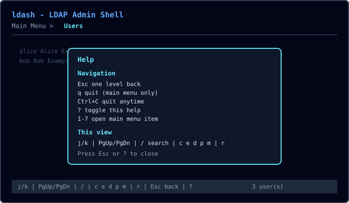

# Terminal UI guide

ldash presents a full-screen terminal UI (TUI) for OpenLDAP administration. The shell uses a sticky header, a content panel, and a footer bar with keys and status.

## Screenshots

*Main menu with number shortcuts and disabled Groups / Samba entries.*

*Users view with sticky column headers and a sticky footer bar.*

*Help overlay (`?`) showing the global navigation model.*

## Starting ldash

1. Install and configure: see [Installation](installation.md) and [Configuration](configuration.md).
2. Run `ldash` from a real terminal (not a bare pipe).
3. Enter the bind password when prompted (unless a credentials file is configured).

## Navigation model

| Key | Action |
| --- | --- |
| `Esc` | Go **one level** back (help → search → form → users → main menu) |
| `q` | Quit — **main menu only** |
| `Ctrl+C` | Quit anytime |
| `?` | Toggle help overlay (Esc/`?` closes help first) |
| `1`–`6` | Jump to / open a main menu item |

On the main menu, `Esc` does not quit; the status line reminds you to press `q`.

## Main menu

| # | Item | Notes |
| --- | --- | --- |
| 1 | Dashboard | Connection health; press `r` to test |
| 2 | Users | List / search / create / edit / delete / password / mail |
| 3 | Groups | Disabled until v0.2 (Enter shows a warning, stays on menu) |
| 4 | Samba | Disabled (planned) |
| 5 | Integration Guide | Values from local runtime config only |
| 6 | Settings | Loaded connection profile |

Move with `j`/`k` or arrow keys, open with `Enter`, or use number keys.

## Dashboard

- Shows server URL, TLS mode, base DN, people DN, and groups DN from your config.
- `r` — test LDAP connection (status shows `Loading:` then `OK:` / `Error:`).
- `Esc` — back to main menu.

## Users

| Key | Action |
| --- | --- |
| `j` / `k` | Move selection |
| `PgUp` / `PgDn` | Page through the list |
| `g` / `Home` | First user |
| `G` / `End` | Last user |
| `/` | Filter (Enter applies; Esc cancels; `Ctrl+U` clears the input) |
| `c` | Create user |
| `e` | Edit selected user |
| `d` | Delete selected user (confirm with `y` twice) |
| `p` | Reset password |
| `m` | Edit mail |
| `r` | Refresh list |
| `Esc` | Back to main menu |

The list shows `Showing a–b of n`. Column widths adapt to the terminal width. Returning from a form keeps cursor, filter, and scroll position.

## Integration Guide and Settings

Read-only panels driven by `~/.config/ldash/config.yaml` and optional `integration.yaml`. Press `Esc` to return to the main menu. See [Integration guide](integration.md).

## Status line

The footer status uses text prefixes (not color alone):

- `OK:` — success
- `Error:` — failure (retry with `r` where applicable)
- `Warn:` — disabled menu item or delete confirmation
- `Loading:` — async work in progress

## Key reference (short)

**Global:** `Esc` back · `?` help · `Ctrl+C` quit · `q` quit on main menu  

**Menu:** `j`/`k` · `1`–`6` · `Enter`  

**Users:** `j`/`k` · `PgUp`/`PgDn` · `/` · `c` `e` `d` `p` `m` · `r`
